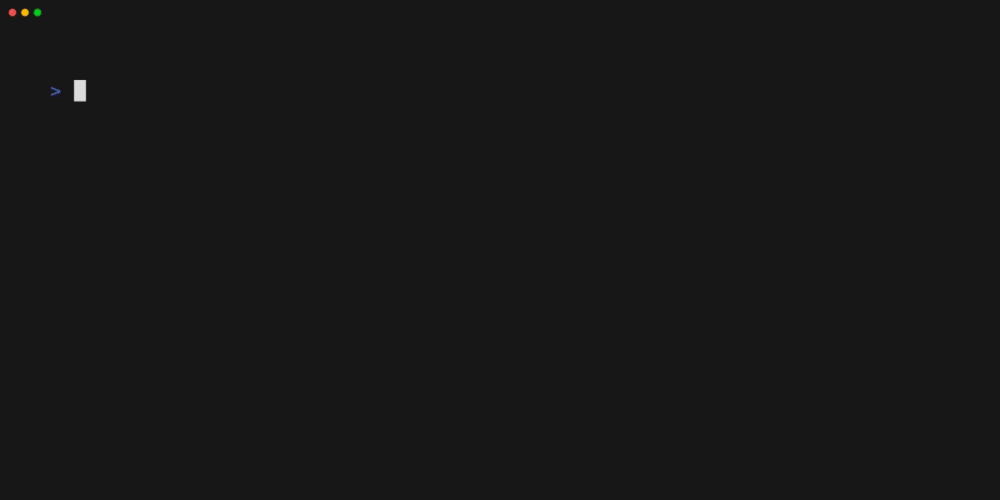

<h1 align="center">
Go Examples
</h1>

For learning purposes only.

## Table of Contents

- [Go Examples](#go-examples)
  - [What This Repo Is?](#what-this-repo-is)
  - [Guideline](#guideline)
  - [Learning Materials](#learning-materials)
  - [Style Guides](#style-guides)
  - [License](#license)

<!-- Created by https://github.com/ekalinin/github-markdown-toc -->

---

## What This Repo Is?

This repo is a collection of Go examples.

Each subdirectroy presents one idea through multiple cases.

---

## Guideline

- Go Developer Roadmap: https://roadmap.sh/golang

So, basic question, how to learn Go?

Currently, I would search articles/explanations from the following sources:

- [Awesome Go](https://github.com/avelino/awesome-go), A curated list of awesome Go frameworks, libraries and software.
- [Effective Go](https://go.dev/doc/effective_go)
- [Go Doc](https://go.dev/doc/)
- [Go FAQ](https://go.dev/doc/faq)
- [Go Wiki](https://go.dev/wiki/), a collection of information about the Go Programming Language.
- [The Go Blog](https://go.dev/blog/)
- [Good First Issue / Go](https://goodfirstissue.dev/language/go)

Basically, all the intermediate-to-advanced knowledge already resides in there.

---

## Learning Materials

- [Go in Action](https://www.oreilly.com/library/view/go-in-action/9781617291784/#:~:text=Go%20in%20Action%20is%20for,and%20idiomatic%20view%20of%20Go.)
- Butcher, M., & Farina, M. (2016). Go in Practice: Includes 70 Techniques. Manning Publications Co..
- Cox-Buday, K. (2017). Concurrency in Go: Tools and Techniques for Developers. " O'Reilly Media, Inc.".
- Tsoukalos, M. (2019). Mastering Go: Create Golang production applications using network libraries, concurrency, machine learning, and advanced data structures. Packt Publishing Ltd.
- Jeffery, T. (2021). Distributed Services with Go: Your Guide to Reliable, Scalable, and Maintainable Systems.
- Titmus, M. A. (2021). Cloud Native Go. " O'Reilly Media, Inc.".
- 100 Go Mistakes and How to Avoid Them [[github]](https://github.com/teivah/100-go-mistakes)
- [Go Concurrency Patterns Github](https://github.com/lotusirous/go-concurrency-patterns)
- [有哪些值得學習的 Go 語言開源項目?](https://www.zhihu.com/question/20801814/answer/1534555951)
- [Go 101](https://go101.org/)
- [Go 語言簡明教程](https://geektutu.com/post/quick-golang.html)
- [Go 語言高性能編程](https://geektutu.com/post/high-performance-go.html)
- [Go Wiki](https://github.com/golang/go/wiki)
- [Youtube Channel: TalkGo](https://www.youtube.com/c/talkgo_night)
- [Go go-to Guide](https://yourbasic.org/golang/)
- [Xargin's Blog](https://xargin.com/), a gopher from China (his github: https://github.com/cch123).
- [qcrao's blog](https://qcrao.com/), github: https://github.com/qcrao
- [Advanced Go Programming](https://github.com/chai2010/advanced-go-programming-book)

---

## Style Guides

- The Google Go Style Guide: https://google.github.io/styleguide/go/
- The Uber Go Style Guide: https://github.com/uber-go/guide

---

[Back to top](#go-examples)

## License

