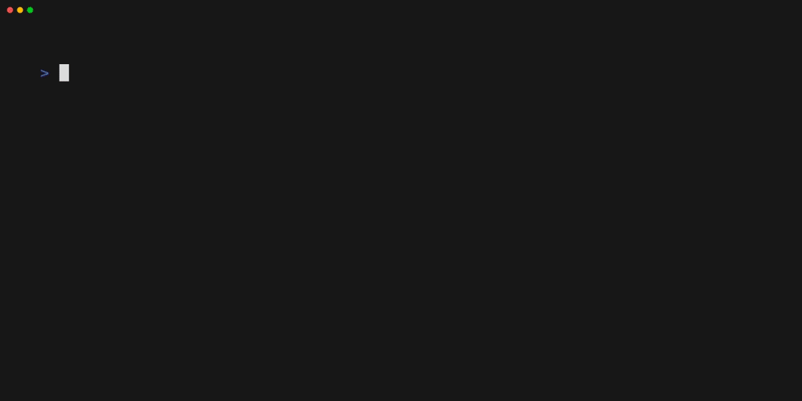

<h1 align="center">
Go Examples
</h1>

For learning purposes only.

## Table of Contents

- [Go Examples](#go-examples)
  - [What This Repo Is?](#what-this-repo-is)
  - [Guideline](#guideline)
  - [Learning Materials](#learning-materials)
  - [Style Guides](#style-guides)
  - [License](#license)

<!-- Created by https://github.com/ekalinin/github-markdown-toc -->

---

## What This Repo Is?

This repo is a collection of Go examples.

Each subdirectory presents one idea through multiple cases.

---

## Guideline

- Go Developer Roadmap: https://roadmap.sh/golang

So, basic question, how to learn Go?

Currently, I would search articles/explanations from the following sources:

- [Awesome Go](https://github.com/avelino/awesome-go), A curated list of awesome Go frameworks, libraries and software.
- [Effective Go](https://go.dev/doc/effective_go)
- [Go Doc](https://go.dev/doc/)
- [Go FAQ](https://go.dev/doc/faq)
- [Go Wiki](https://go.dev/wiki/), a collection of information about the Go Programming Language.
- [The Go Blog](https://go.dev/blog/)
- [Good First Issue / Go](https://goodfirstissue.dev/language/go)

Basically, all the intermediate-to-advanced knowledge already resides in there.

---

## Learning Materials

[Learning Materials](docs/learning-materials.md)

---

## Style Guides

- The Google Go Style Guide: https://google.github.io/styleguide/go/
- The Uber Go Style Guide: https://github.com/uber-go/guide

---

[Back to top](#go-examples)

## License

